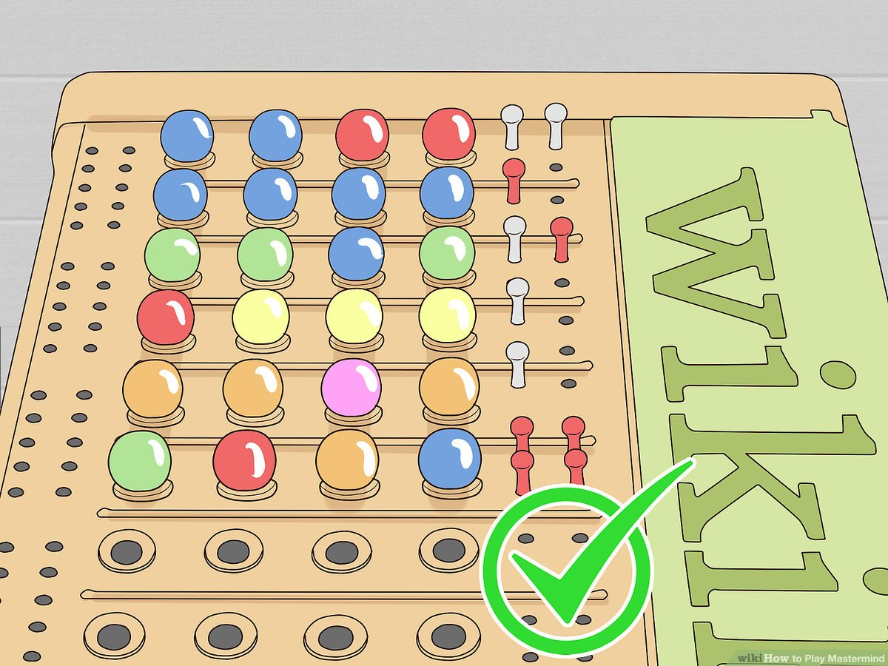

# Assignment 02: Mastermind

for the course Introduction to Data Science and Programming (Autumn 2025) at ITU

**Due: September 18, 2025, at 23:59** (hand in through [learnIT](https://learnit.itu.dk/course/view.php?id=3024641); hand in one single .py file.)

**TLDR: Write a `.py` script that allows you to play the Mastermind game in your command line interface.**

* [Detailed rules of Mastermind](https://www.wikihow.com/Play-Mastermind)
* [Online version of Mastermind](https://www.webgamesonline.com/codebreaker/)

If you have not heard of that game, we recommend you play a couple of rounds online (or with a colleague at the Analog Cafe) to get the hang of it, before diving into the code development.

## Rules of the game (in the CLI)

1. There are 8 colors.
2. The computer randomly generates a 4-color code (order matters; colors do not repeat).
3. The user tries to guess the code.
4. For every guess the user makes, the computer prints out an evaluation.
5. In the evaluation, the user gets "1 white pin" for every color that is guessed correctly, but in the false position; and "1 red pin" for every color that is guessed correctly *and* in the right position.
6. The user continues making guesses until they guess the correct combination (all 4 colors, each of them in the right position.)
7. The game ends.

<p style="text-align:center;">
    
</p>

## Minimum functionalities of your code

When ran from the CLI, this is what your code should do:
* "under the hood", generate a random 4-color combination (drawn without replacement), selecting from 8 possible colors.
* prompt the user to input their guess (a 4-color combination, without repetition)
* while user is trying to guess:
    * evaluate the guess
    * print out the guess and its evaluation (it is up to you how to format it; see below for an example)
    * as long as the user hasn't guessed correctly: continue prompting
    * as soon as the user guessed the correct combination: print out "You won!" and end script.

**Guesses are evaluated as follows:**
* for every color that is guessed correctly, but in the wrong position, a WHITE pin.
* for every color that is guessed correctly AND in the correct position, a RED pin.

**8 possible colors:**
* use one-capital-character abbreviations for the colors: blue, yellow, green, red, purple, turquoise, orange, chocolate.
* Your list of colors-to-choose from should look like: `["B", "Y", "G", "R", "P", "T", "O", "C"]`

**This is what the CLI output could look like:**
```
anvy@mac622265  assignments % python mm.py
Guess a combination of colors! BGRY
['B', 'G', 'R', 'Y'] R: 0 W: 2
Guess a combination of colors! RGOB
['R', 'G', 'O', 'B'] R: 0 W: 3
Guess a combination of colors! COBG
['C', 'O', 'B', 'G'] R: 1 W: 3
Guess a combination of colors! GCBO
['G', 'C', 'B', 'O'] R: 4 W: 0
YOU WON
```

## To make the TAs' lives easier

**Make sure to include your info in 2 commented-out lines at the beginning of your .py file:**

```python
# NAME = ""
# ITU_MAIL = "" # xxxx@itu.dk
```